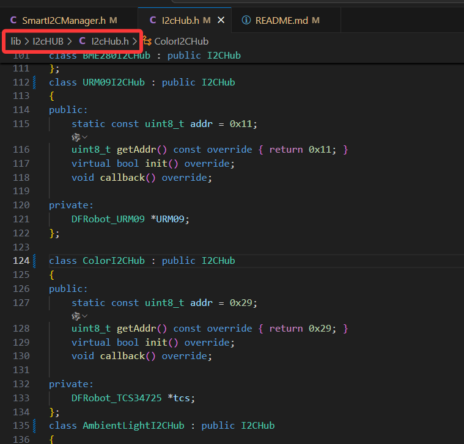
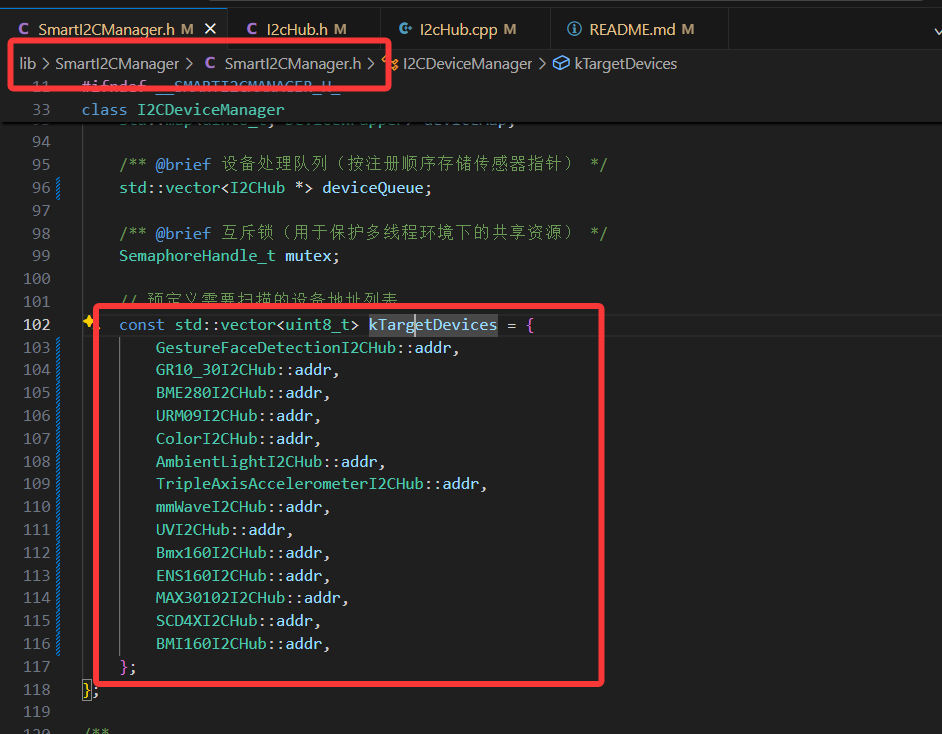

# 需求

https://h7dvigefi0.feishu.cn/wiki/Npxrwy3WwivmMFkGKB7cPhNKnVg?table=ldxRwH1orn4lsur9
一个运行在ESP32的MQTT
## MQTT BROKER 项目
[idf-mqtt-broker](github.com/nopnop2002/esp-idf-mqtt-broker)
# PlatformIO

[PlatformIO](https://platformio.org/install/ide?install=vscode)

## 1.VS cod安装


## 2.打开项目


PlatformIO会根据`.ini`自动安装编译链和ardunio库

## 3.项目环境依赖、编译编译与宏

环境设置

```ini
[env:dfrobot_romeo_esp32s3];环境开始
platform = espressif32
board = dfrobot_romeo_esp32s3
board_build.mcu = esp32s3
board_build.partitions = app3M_fat9M_16MB.csv ;flash分区表
board_upload.flash_size = 16MB
board_build.f_cpu = 240000000L
lib_ldf_mode = chain+

framework = arduino ;框架
build_type = release
;ardunio 库依赖
lib_deps = 
  olikraus/U8g2@^2.36.5
  adafruit/DHT sensor library@^1.4.6
  paulstoffregen/OneWire@^2.3.8
  milesburton/DallasTemperature@^4.0.4
  bblanchon/ArduinoJson@^7.4.1
  madhephaestus/ESP32Servo@^3.0.6
  xylopyrographer/LiteLED@1.2.1
  0nism/ESP32-DHT11@^1.0.1
  beegee-tokyo/DHT sensor library for ESPx @ ^1.19
monitor_speed = 115200
board_build.filesystem = fatfs
upload_port= COM5
;编译宏定义
build_flags = 
 -D MG_ARCH=3
 -D CONFIG_PUBLISH=1
 -D CORE_DEBUG_LEVEL=4
 -D CONFIG_SUBSCRIBE=1
 -D CONFIG_IDF_TARGET_ESP32S3=1
 -D CONFIG_DISABLE_HAL_LOCKS=1
 -D CONFIG_WS2812_MODE_STRIP=1 
 -D ARDUINO_USB_MODE=0
 -D CONFIG_BROKER_AUTHENTICATION=1
build_unflags =
 -DARDUINO_USB_MODE=1
```

## 4.编译


## 5.安装Ardunio库


## 6.新建库

```md
|--lib
|  |
|  |--Bar
|  |  |--docs
|  |  |--examples
|  |  |--src
|  |     |- Bar.c 
|  |     |- Bar.h
|  |  |- library.json (optional, custom build options, etc) https://docs.platformio.org/page/librarymanager/config.html
|  |
|  |--Foo
|  |  |- Foo.c
|  |  |- Foo.h
|  |
|  |- README --> THIS FILE
|
|- platformio.ini
|--src
   |- main.c
```

在lib下面新建一个文件夹后，放入`.cpp`和`.h`

## 下载程序

按`BOOT` 后按`RST`,会出现一个新的串口(BOOT下串口号不一样)，存在USB JTAG难以下载情况下，推荐使用UART下载。

## 固件

固件位置位于

```
.pio\build\dfrobot_romeo_esp32s3\firmware.bin
```


## MQTT调试

* [MQTT.fx](https://iotcore-dev-tool.gz.bcebos.com/mqttfx/1.7.1/mqttfx-1.7.1-windows-x64.exe)
  IO控制
  
  ```Python
  import paho.mqtt.client as mqtt
  import time
  import json


    MQTT_BROKER = "192.168.137.219"  # 修改为你的 MQTT 服务器地址
    MQTT_PORT = 1883
    MQTT_TOPIC = "topic_output"


    client = mqtt.Client()
    client.connect(MQTT_BROKER, MQTT_PORT, 60)
    
    state = False
    
    try:
        while True:
            payload = {"io2": "1.00" if state else "0.0"}
            json_str = json.dumps(payload)
            client.publish(MQTT_TOPIC, json_str)
            print("Sent:", json_str)
            state = not state
            time.sleep(1.1)
    except KeyboardInterrupt:
        print("Stopped.")
        client.disconnect()
```

### WS2812

```python
import paho.mqtt.client as mqtt
import time
import colorsys

# MQTT 参数
broker = "192.168.137.153"  # 替换 ESP32 IP
port = 1883
topic = "topic_output"
key = "io1"

# 灯珠数量
led_count = 7

# MQTT 客户端连接
client = mqtt.Client()
client.username_pw_set("mqtt", "dfrobot")
client.connect(broker, port, 60)

def hsv_to_rgb(h, s=1.0, v=1.0):
    r, g, b = colorsys.hsv_to_rgb(h, s, v)
    return int(r * 255), int(g * 255), int(b * 255)

def generate_gradient(step):
    rgb_values = []
    for i in range(led_count):
        hue = ((i + step) % led_count) / float(led_count)
        r, g, b = hsv_to_rgb(hue)
        rgb_values.extend([r, g, b])
    return rgb_values

def format_message(rgb_values):
    rgb_str = ' '.join(str(v) for v in rgb_values)
    return {key: rgb_str}

try:
    step = 0
    while True:
        rgb_values = generate_gradient(step)
        payload = format_message(rgb_values)
        client.publish(topic, str(payload))
        step += 1
        time.sleep(0.01)

except KeyboardInterrupt:
    print("结束控制。")
    client.disconnect()
```

### 180舵机测试

```python
import paho.mqtt.client as mqtt
import time
import json

# MQTT 参数
broker = "192.168.137.219"  # 替换为你的 ESP32 IP
port = 1883
topic = "topic_output"
key = "io5"  # 控制哪个舵机，对应 ESP32 端的 io 索引或引脚

# MQTT 连接
client = mqtt.Client()
client.connect(broker, port, 60)

def send_angle(angle):
    angle = max(0, min(180, angle))  # 限制范围
    payload = json.dumps({key: str(angle)})
    client.publish(topic, payload)

def dance_sequence():
    # 跳舞动作：左右 -> 上下 -> 快速摆动
    angles = [90, 45, 135, 90, 60, 120, 90]
    delays = [0.4, 0.4, 0.4, 0.3, 0.3, 0.3, 0.2]

    for _ in range(3):  # 跳三轮
        for angle, d in zip(angles, delays):
            send_angle(angle)
            time.sleep(d)

    # 快速小幅抖动（像点头）
    for _ in range(10):
        send_angle(100)
        time.sleep(0.1)
        send_angle(80)
        time.sleep(0.1)

try:
    while True:
        dance_sequence()
        time.sleep(1)

except KeyboardInterrupt:
    print("停止跳舞")
    client.disconnect()
```
# 增加一个传感器
## IO类
```cpp
//pin 对应实际GPIO， io_idx对应用户设置io索引（1~6）
//type 传感器枚举类型
//控制类执行器输入控制的值
//res 传感器的获取值的返回值
    void (*callBack)(uint8_t pin, uint8_t io_idx, SensorName name, const char *arg, char *res);

```
## I2C传感器
`I2CHub` I2C传感器的基类
实现新的传感器需要继承`I2CHub`这个类
实现I2C地址`addr`, 获取数据的回调函数`callback`给data值，初始化传感器`init()`
```cpp
class I2CHub
{
public:
    /**
     * @brief 初始化传感器
     *
     * @details 执行传感器的初始化配置，如设置通信速率、校准参数等。
     */
    virtual void init() = 0;

    /** @brief 传感器I2C地址（静态常量） */
    static const uint8_t addr;

    /**
     * @brief 获取传感器I2C地址
     *
     * @return uint8_t 传感器的I2C地址
     */
    virtual uint8_t getAddr() const = 0;

    /** @brief 传感器名称 */
    String name;

    /**
     * @brief 传感器数据采集回调函数
     *
     * @details 执行传感器数据采集并更新内部数据缓存。
     */
    virtual void callback() = 0;

    /**
     * @brief 获取传感器数据字符串
     *
     * @return String 格式化的传感器数据字符串
     */

    String getResStr();

    /** @brief 虚析构函数，确保正确释放派生类资源 */
    virtual ~I2CHub() = default;

protected:
    /** @brief 传感器数据缓存 */
    String data;
};
```
# 注意事项
1. MQTT最大消息量为512
2. WS2812灯带初始化大小为32
# todo
1.采集时间和发包时间独立
2.DHT11的缓存的值
3. BNO055传感器未添加


# 2025/08/26

## 项目添加传感器

### IO类

在lib\IOHub文件夹下

1. IOHub.h中添加对应枚举类型


2. IOHub.h中创建对应IO类,IOHub.cpp中实现对应IO类


3. 在SmartIOManager中添加对应IO的实例


4. 在SmartIOManager中添加字符串映射为对应的传感器类型枚举值


5. 若是采集类IO设备，需要在SmartIOManager中添加对应回调


6. 若是控制类IO设备，需要在SmartIOManager中添加对应控制


7. 在Display中添加对应标签 (要与4.中的字符串保持一致大小写无所谓)


8. 特殊需要持续不断采集的IO设备, 在SmartIOManager中添加到ioConhubs中

### I2C类

1. I2cHub中添加新的I2C传感器类并实现


2. 在SmartI2CManager中添加对应I2C传感器为白名单


3. 添加对应的I2C实例


## 解决U盘设备在mac上识别为同一UUID问题

1. 替换 使用ESP-IDF-V4.4.8进行编译出新的libfatfs.a

```c++
// 新函数：基于设备默认MAC地址生成UUID
DWORD get_mac_based_uuid(void) {
    uint8_t mac[6] = {0};
    esp_err_t ret = esp_efuse_mac_get_default(mac);
    
    if (ret == ESP_OK) {
        // 使用MAC地址生成唯一UUID（取后4字节更随机）
        return (mac[2] << 24) | (mac[3] << 16) | (mac[4] << 8) | mac[5];
    }
    
    // 后备方案：使用硬件随机数生成器
    return esp_random() & 0xFFFFFFFF;
}
```


2. 替换SDK中的libfatfs.a


3. 你也可以使用res/下面的直接替换

## 版本配置
目前按照如下配置,若需其余库可自行添加
```
  [env:dfrobot_romeo_esp32s3]
  platform = espressif32@ ^6.11.0
  board = dfrobot_romeo_esp32s3
  board_build.mcu = esp32s3
  board_build.partitions = app3M_fat9M_16MB.csv
  board_upload.flash_size = 16MB
  board_build.f_cpu = 240000000L
  lib_ldf_mode = chain+
  framework = arduino
  build_type = release
  lib_deps = 
    olikraus/U8g2@^2.36.5
    adafruit/DHT sensor library@^1.4.6
    paulstoffregen/OneWire@^2.3.8
    milesburton/DallasTemperature@^4.0.4
    bblanchon/ArduinoJson@^7.4.1
    madhephaestus/ESP32Servo@^3.0.6
    xylopyrographer/LiteLED@1.2.1
    0nism/ESP32-DHT11@^1.0.1
  monitor_speed = 115200
  board_build.filesystem = fatfs
  upload_port = COM5
  build_flags = 
    -D MG_ARCH=3
    -D CONFIG_PUBLISH=1
    -D CORE_DEBUG_LEVEL=4
    -D CONFIG_SUBSCRIBE=1
    -D CONFIG_IDF_TARGET_ESP32S3=1
    -D CONFIG_DISABLE_HAL_LOCKS=1
    -D CONFIG_WS2812_MODE_STRIP=1
    -D ARDUINO_USB_MODE=0
    -D CONFIG_BROKER_AUTHENTICATION=1
  build_unflags = 
    -DARDUINO_USB_MODE=1
```

#2025/9/4更新记录
##调整
1.去掉了topic_test的订阅
2.将心率传感器换成了sen0518
3.增加了sen0626识别到人脸的坐标（原来已经有，但需求书里面写了增加）
4.当手势传感器未识别到手势时保持上一次的识别结果，去掉了原来的none
5.去掉了sen0203心率传感器和sen0204肌电传感器
6.更改了原I2C类传感器的类为`IOHub`和`IOHub`类保持一致，同时也更改了原来I2C类传感器的文件名称已经存放文件夹的名称
    各个模块的实现以及声明放在了I2cHub文件夹下面，整个I2C设备的管理放在了SmartI2CManager文件夹下，这和IO设备的管理也一致，使得架构更加清晰。

##增加
1.sen0514 空气质量传感器
2.sen0518 心率血氧传感器
3.sen0536 CO2传感器
4.sen0250 6轴惯性运动传感器
5.ser0053 9g300°离合舵机